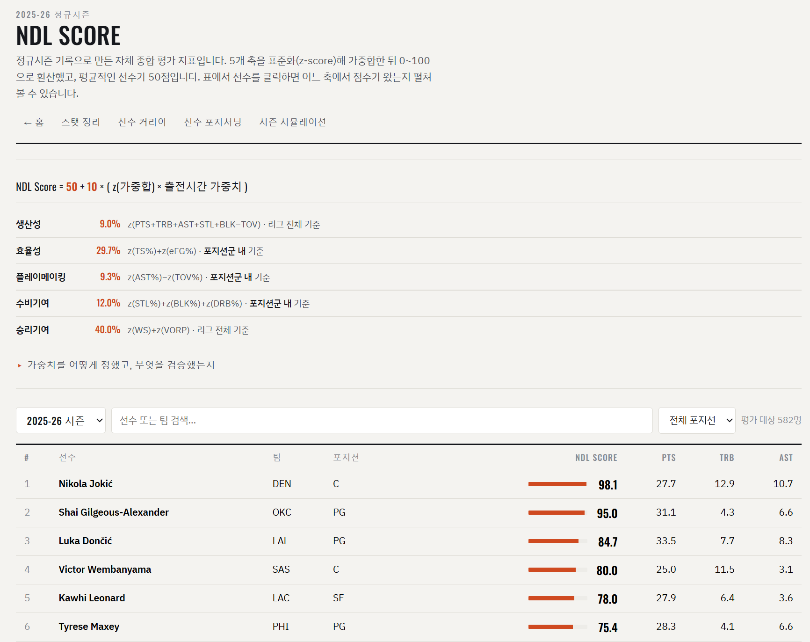
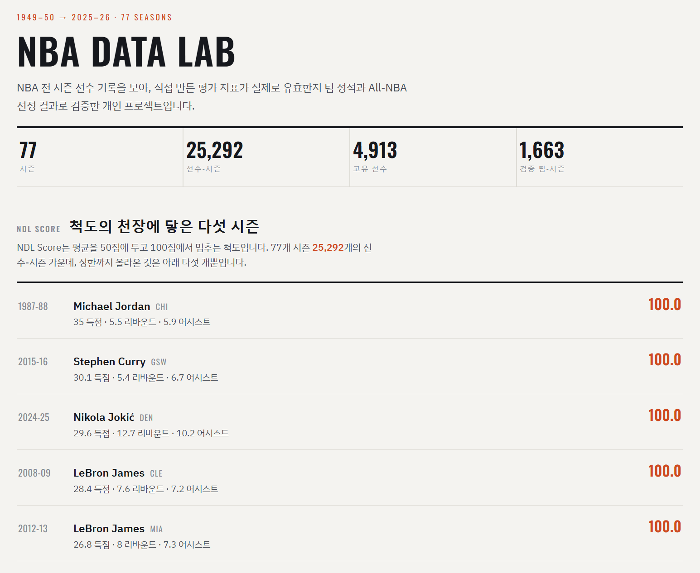
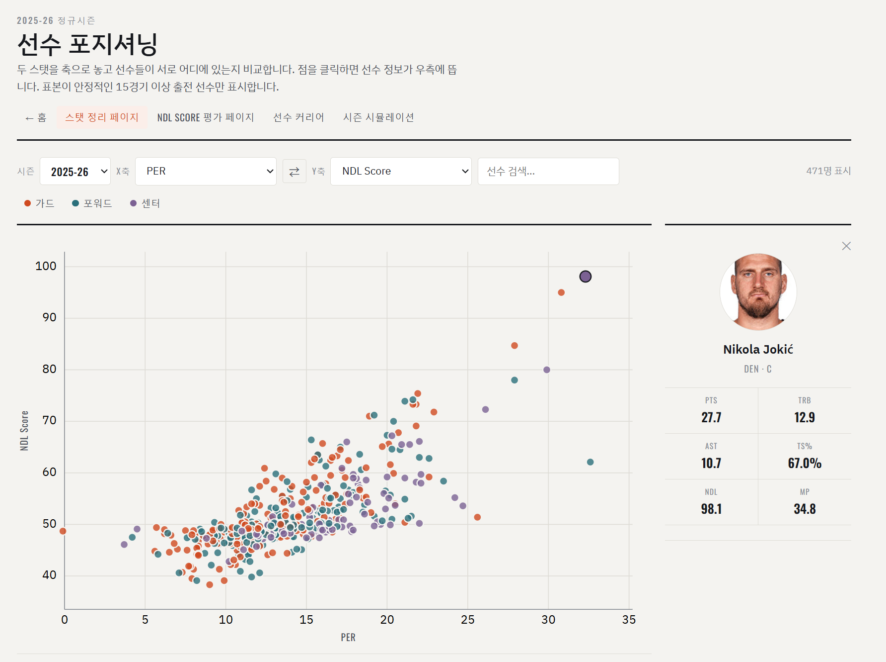
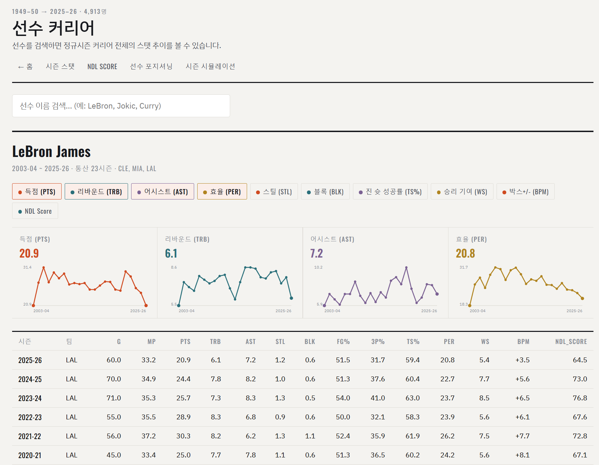

# NBA DATA LAB

NBA 77개 시즌 선수 데이터를 수집·가공하고, 직접 만든 선수 평가 지표가 실제로 유효한지
팀 성적으로 검증한 개인 프로젝트입니다.

[](https://nba-data-lab.vercel.app/ndl)

**▶ 이미지를 클릭하면 실제 사이트로 이동합니다 — https://nba-data-lab.vercel.app**

[시즌별 스탯](https://nba-data-lab.vercel.app/stats) ·
[NDL Score](https://nba-data-lab.vercel.app/ndl) ·
[선수 커리어](https://nba-data-lab.vercel.app/player) ·
[선수 포지셔닝](https://nba-data-lab.vercel.app/scatter) ·
[시즌 시뮬레이션](https://nba-data-lab.vercel.app/game)

| | |
|---|---|
| 수집 | 77개 시즌(1949-50 ~ 2025-26), 선수-시즌 25,292행, 고유 선수 4,913명 |
| 검증 | 팀-시즌 1,663개(1947~2024) |
| 기술 | Python, pandas, NumPy, SciPy, 정적 HTML/CSS/JS |

**요약**

- 임의로 정했던 지표 가중치를 팀 실제 성적으로 학습시켜, 학습에 쓰지 않은 2016~2024 구간에서
  **9개 시즌 전부 개선**(0.878 → 0.922)되는 것을 확인했습니다.
- 두 가지 방식으로 채점했습니다. 팀 성적 설명력은 공인 지표에 못 미치지만(0.890 vs WS 0.941),
  **그해 최고 선수를 뽑는 정확도는 더 높았습니다**(All-NBA 일치율 65.8% vs WS 64.5%).
- **측정해보고 채택하지 않은 시도가 두 개** 있습니다. 판단 근거를 수치로 적었습니다.

---

## 문제 정의

선수 한 명의 기여도를 하나의 숫자로 나타내는 공인 지표가 이미 여럿 있습니다(PER, WS, BPM).
다만 계산 과정이 **블랙박스에 가까워, 점수가 왜 그렇게 나왔는지 항목별로 알 수 없습니다.**
그래서 득점·효율·플레이메이킹·수비·승리기여 5개 축으로 이루어진 지표를 직접 만들었습니다
(NDL Score).

문제는 그다음입니다. 5개 축을 하나로 합치려면 가중치가 필요한데, 처음에는 임의의 값으로
시작할 수밖에 없었습니다(25/20/15/20/20). 이 배분이 맞는지 확인할 방법이 없다면 지표가
그럴듯해 보여도 근거는 없는 셈입니다. **이 프로젝트의 대부분은 그 초기값을 검증 가능한
값으로 바꿔 나간 과정입니다.**

## 접근

### 1. 데이터 파이프라인

시즌별로 파일을 따로 저장하고 이미 받은 시즌은 건너뛰도록 해 중간에 끊겨도 이어받을 수
있게 했습니다. 받아온 원본은 로컬에 보관해, 지표 공식을 바꿔도 다시 받지 않고 전체를
재계산합니다.

까다로웠던 건 **기록 항목이 시대마다 다르다**는 점입니다. 스틸·블록은 1973-74, 턴오버는
1977-78, 3점슛은 1979-80, 슛 위치는 1996-97 시즌부터 집계됩니다. 그 이전에는 해당 칸이
아예 없습니다.

여기서 버그가 발생했습니다. "이 시대에 없는 기록"은 처리해뒀는데 **"있지만 이 선수만 빠진"**
경우를 놓쳐, 빈 값이 덧셈으로 번지면서 **1,409명(1970-71~1974-75 시즌 선수의 90%)의 점수가
사라졌습니다.** 두 경우를 구분해 후자는 그 항목만 빼고 계산하도록 고쳤습니다.

### 2. 채점 기준 만들기

가중치를 검증하려면 정답지가 필요합니다. **팀의 경기당 평균 득실차**를 정답지로 삼았습니다.

이 값을 서로 다른 두 공개 데이터셋에서 각각 계산했습니다. 겹치는 **146개 팀-시즌에서 두 값이
소수점 이하까지 일치**하는 것을 확인한 뒤 사용했습니다.

채점 방식은 이렇습니다. 한 팀 선수들의 점수를 출전시간 가중 평균해 팀 점수를 만들고, 그 값이
**그 팀의 실제 득실차를 얼마나 설명하는지** 상관계수로 잽니다. 시즌마다 구해 평균 냅니다.

### 3. 가중치 학습 — 뻔한 답으로 쏠리는 문제

제약 없이 최적화하자 **5개 축 중 승리기여 하나가 전체 가중치의 83%를 가져갔습니다.**

당연한 결과였습니다. 승리기여 축은 WS·VORP를 재료로 쓰는데, **이 두 지표 자체가 팀 성적에서
거꾸로 계산해 선수에게 나눠준 값**입니다. 팀 성적을 맞히라고 시켰더니 팀 성적으로 만든 재료를
고른 셈입니다. 이 답을 쓰면 NDL Score는 기존 지표의 재포장이 되고, 5개 축으로 분해한다는
목적이 사라집니다. 그래서 **각 축을 5~40%로 제한**했습니다.

과거 데이터에만 맞는 답을 거르기 위해 데이터를 세 덩어리로 나눴습니다.

- **학습용** — 1952~2015년 홀수 연도 시즌. 가중치는 여기서만 학습
- **검증용** — 같은 기간 짝수 연도 시즌
- **최종 시험용** — 학습·검증 어디에도 쓰지 않은 **2016~2024**. 3점슛 비중이 크게 늘어 경기
  양상이 달라진 구간이라, 여기서도 개선이 유지되는지가 판단 기준입니다

### 4. 두 번째 채점 — All-NBA 일치율

팀 득실차 검증은 "좋은 선수가 많은 팀이 실제로 잘했나"를 보는 간접 방식입니다. 더 직접적인
기준으로, **그 시즌 최고 선수 명단을 얼마나 맞히는지**도 쟀습니다. 지표 상위 N명과 실제
All-NBA 선정 N명(1·2·3팀)의 겹치는 비율입니다.

### 5. 검토했지만 채택하지 않은 것 (1) — 팀 환경 보정

수비 기록은 팀 환경을 탑니다. 수비 좋은 팀에 있으면 개인 기록도 좋아 보일 수 있어,
**팀 덕분에 얻은 몫을 걷어내고 개인 기여분만 남기는 보정**을 만들었습니다. 같은 팀 동료들의
수비 지표(본인 제외)로 회귀분석을 돌려, 설명되지 않는 부분만 개인 몫으로 보는 방식입니다.

재보니 **개선폭이 +0.002에 그쳐 넣지 않았습니다.** 같은 회귀 아이디어를 개인 보정이 아니라
가중치 학습에 쓴 쪽이 +0.044로 훨씬 효과적이었습니다.

부산물이 하나 있습니다. 회귀계수가 **음수**로 나왔는데, 동료가 수비를 잘할수록 개인의
리바운드·스틸 기록이 오히려 줄어든다는 뜻입니다. 리바운드 하나는 한 명만 잡으니 잘하는
동료와 기록을 나눠 갖게 됩니다.

### 6. 검토했지만 채택하지 않은 것 (2) — 비율 대신 개수

플레이메이킹·수비기여 축은 비율(AST%, STL% 등)을 쓰는데, 생산성 축은 같은 종류의 기록을
경기당 개수로 씁니다. 한 지표 안에 두 방식이 섞여 있어, **네 가지 조합을 전부 학습·검증**했습니다.

축 하나만 놓고 보면 **개수 쪽이 우세**했습니다(플레이메이킹 0.410→0.479, 수비기여 0.339→0.418).
그런데 **최종 지표는 오히려 나빠졌습니다**(0.935→0.930).

원인은 **정보 중복**입니다. 수비기여를 개수로 바꾸면 생산성 축과 상관이 **0.902**까지 올라갑니다.
생산성 축이 이미 리바운드·스틸·블록을 개수로 담고 있어 같은 것을 두 번 재는 셈입니다
(비율은 0.329로 서로 다른 것을 잽니다). 네 조합의 순위도 중복 정도와 같은 순서였습니다.

| 플레이메이킹 | 수비기여 | 최종 시험 점수 |
|---|---|---|
| 개수 | 비율 | 0.9372 |
| 비율 | 비율 | 0.9351 *(현재)* |
| 개수 | 개수 | 0.9295 |
| 비율 | 개수 | 0.9270 |

1위 조합이 현재보다 +0.0021 나았지만, 앞서 +0.002를 이유로 버린 것과 같은 크기라
**기준을 일관되게 적용해 채택하지 않았습니다.**

> 이 실험에서 얻은 건 성능이 아니라 이 사실입니다 —
> **혼자 놓고 보면 더 좋은 재료가, 합쳐 놓으면 더 나쁜 결과를 낼 수 있다.**

### AI 활용 범위

개발 도구로 Claude Code를 사용했습니다. **코드 작성은 AI가, 무엇을 만들고 무엇을 버릴지
판단하는 것은 제가** 했습니다.

- 최적화가 **팀 성적에서 역산된 지표로 팀 성적을 맞히는 구조**임을 알아채고 제한을 건 것 (3)
- 학습·검증·최종시험으로 데이터를 나눠 검증 체계를 짠 것 (3)
- 채점 데이터를 두 출처에서 각각 구해 대조한 뒤 사용한 것 (2)
- 두 기능을 만들어 측정하고 **효과가 작아 넣지 않기로 결정한 것** (5·6)

## 결과

### ① 가중치 학습 전후 — 팀 성적 설명력

팀 점수가 실제 팀 득실차를 얼마나 설명하는지(상관계수). 1에 가까울수록 좋습니다.

| 구간 | 시즌 | 감으로 정한 가중치 | 학습한 가중치 | 개선 |
|---|---|---|---|---|
| 학습용 (1952~2015 홀수) | 32 | 0.828 | 0.878 | +0.050 (29/32) |
| 검증용 (1952~2015 짝수) | 32 | 0.847 | 0.894 | +0.047 (31/32) |
| **최종 시험용 (2016~2024)** | 9 | 0.878 | **0.922** | **+0.044 (9/9)** |
| 전체 | 73 | 0.842 | 0.890 | +0.048 (69/73) |

세 구간의 개선폭이 +0.044~+0.050으로 거의 같습니다. 과거 데이터에만 맞는 답을 찾은 것이라면
3점 혁명 이후 경기 양상이 달라진 최근 구간에서 개선폭이 줄어야 하는데, 그렇지 않았습니다.

### ② All-NBA 일치율 — 최고 선수를 뽑는 정확도

각 지표의 상위 N명이 실제 All-NBA 선정 N명과 얼마나 겹치는지(77개 시즌).

| 지표 | 전체 평균 | 2000년 이후 |
|---|---|---|
| **NDL Score** | **65.8%** | **69.4%** |
| WS | 64.5% | 67.7% |
| PER | 57.1% | 57.3% |
| BPM | 38.6% | 55.3% |

**팀 성적 설명력에서는 공인 지표에 뒤졌지만, 최고 선수를 뽑는 정확도에서는 앞섰습니다.**
두 채점이 서로 다른 것을 재고 있다는 뜻입니다.

이유를 확인해보니 설계 차이였습니다. NDL Score는 출전시간이 적은 선수의 점수를 평균 쪽으로
당기는데, 이 보정이 **팀 성적 상관은 약 0.02 떨어뜨리지만**(보정 없으면 0.909) 상위권 명단은
지켜줍니다. 보정이 없는 BPM은 2023-24 상위 15명에 **1~3경기만 뛴 선수가 6명** 들어갑니다.
NDL Score 상위 15명에는 40경기 미만이 한 명도 없습니다.

### 학습된 가중치

| 구성요소 | 무엇으로 계산하나 | 감으로 정한 값 | 학습한 값 |
|---|---|---|---|
| 생산성 | 득점 + 리바운드 + 어시스트 + 스틸 + 블록 − 턴오버 | 25.0% | 9.0% |
| 효율성 | 슈팅 효율 (TS%, eFG%) | 20.0% | **29.7%** |
| 플레이메이킹 | 어시스트 비율 − 턴오버 비율 | 15.0% | 9.3% |
| 수비기여 | 스틸·블록·수비리바운드 비율 | 20.0% | 12.0% |
| 승리기여 | 팀 승리 기여도 추정치 (WS, VORP) | 20.0% | **40.0%** |

생산성이 25% → 9%로 내려가고 효율성이 20% → 29.7%로 올라갔습니다. **많이 넣는 것보다
적게 던져 많이 넣는 쪽이 팀 성적과 더 붙어 있다**는 결과입니다.

> **설계 규칙 두 가지**
>
> **비교 대상을 나눕니다.** 생산성·승리기여는 리그 전체와 비교하지만, 효율성·플레이메이킹·수비기여는
> 같은 포지션끼리만 비교합니다. 센터는 골밑에서 쏘니 슈팅 효율이, 가드는 공을 오래 잡으니
> 어시스트가 구조적으로 높습니다. 보정하지 않으면 포지션이 곧 점수가 됩니다.
>
> **적게 뛴 선수는 잘라내지 않고 끌어당깁니다.** 총 출전시간이 2,000분에 못 미치는 만큼
> 점수를 평균(50점) 쪽으로 당깁니다. 표본이 작은 선수를 명단에서 지우지 않으면서도
> 상위권을 차지하지 못하게 하는 방식입니다.

## 화면

| | |
|---|---|
| [](https://nba-data-lab.vercel.app) | [](https://nba-data-lab.vercel.app/scatter) |
| **홈** — 수집 규모와, 25,292개 선수-시즌 중 100점 상한에 닿은 다섯 시즌 | **선수 포지셔닝** — 두 스탯을 축으로 비교. 점을 누르면 선수 정보가 열림 |

[](https://nba-data-lab.vercel.app/player)

**선수 커리어** — 선수를 검색해 스탯별 추이를 보고, 아래 표에서 시즌별 기록을 확인합니다.

## 한계

- **팀 성적 설명력은 공인 지표에 못 미칩니다.** 73개 시즌 평균으로 NDL Score 0.890,
  WS 0.941, BPM 0.987입니다. 다만 WS·BPM은 팀 성적에서 역산해 만든 지표라 이 채점에서
  유리하며, 같은 지표들이 All-NBA 일치율에서는 뒤집힙니다.
- **옛날 시즌은 평가 축이 비어 있습니다.** 1973-74 이전에는 스틸·블록을 기록하지 않아
  수비기여 축이 사실상 작동하지 않습니다.
- **시뮬레이션은 1996-97 이후만 지원합니다.** 엔진이 슛 위치를 기준으로 경기를 돌리는데
  그 이전에는 해당 데이터가 없습니다. 넣으면 모든 선수가 같은 슛 성향을 갖게 되어 제외했습니다.
- **팀 성적 채점 구간이 2024년까지입니다.** 사용한 공개 데이터셋이 그 이후를 다루지 않습니다.

### 다음에 할 것
- 2025~2026 시즌 팀 성적 데이터를 확보해 채점 구간 연장
- 시대별로 나눠 가중치 학습 (3점 도입 전후로 최적 가중치가 다를 가능성)

---

## 실행

```bash
pip install -r requirements.txt

python data/fetch_all_seasons.py --force   # 77개 시즌 수집·계산 (캐시 사용)
python data/fetch_team_margins.py          # 채점용 팀 득실차
python data/optimize_weights2.py           # 가중치 학습 (제약 조건 3종 비교)
python data/report_final.py                # 학습 전후 성능 (팀 득실차 기준)
python data/validate_allnba.py             # All-NBA 일치율
python data/exp_hybrid.py                  # 비율 vs 개수 실험
python data/build_site.py                  # 정적 사이트 빌드 → site/
python data/serve_site.py                  # 로컬 미리보기 → localhost:8000
```

## 구조

```
data/    파이프라인·검증 스크립트, 페이지 템플릿
site/    배포본 (Vercel이 이 폴더를 루트로 서빙, push 시 자동 배포)
```

각 페이지는 데이터를 HTML에 포함해 원본은 2~7MB이지만, 전송 시 brotli 압축으로 1MB 내외입니다.
캐시·중간 데이터는 용량 문제로 저장소에서 제외했습니다(가공 결과는 `site/` HTML에 이미 포함).
